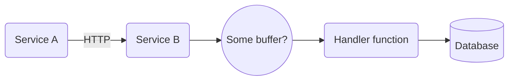
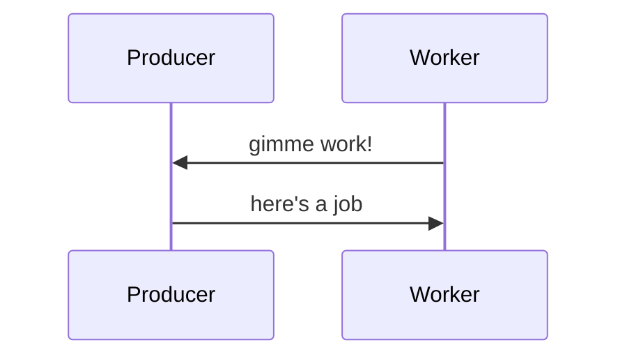
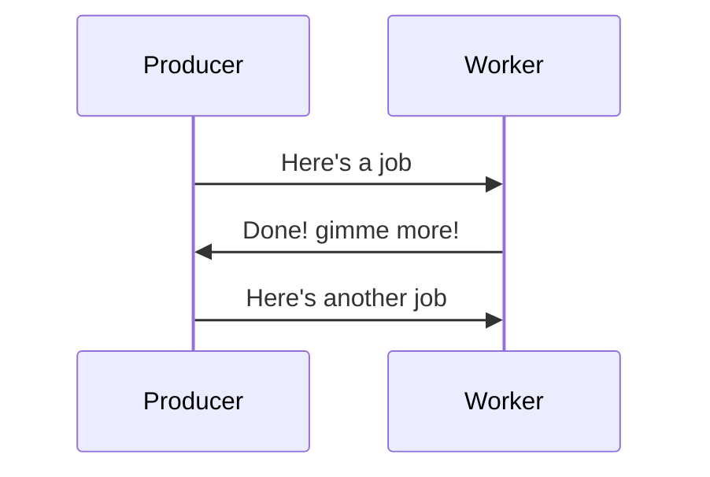

---
# try also 'default' to start simple
theme: default
title: Node and the art of Backpressure
info: |
  Backpressure and flow management are fundamental required for reliable integration of your Node servers with the rest of the system. Backpressure is relatively natural in synchronous runtimes but Node's async nature requires us to be mindful of it in our code.
  This talk explains backpressure, why it is important and how to properly implement it in Node.js.
class: text-center
# https://sli.dev/custom/highlighters.html
highlighter: shiki
# https://sli.dev/guide/drawing
drawings:
  persist: false
# slide transition: https://sli.dev/guide/animations#slide-transitions
transition: slide-left
# enable MDC Syntax: https://sli.dev/guide/syntax#mdc-syntax
mdc: true
---
# Node and the art of Backpressure
## Avishai Ish-Shalom

<div class="absolute flex flex-row bottom-4 left-2">

<span>@nukemberg</span>
</div>
---

# What's wrong with this code?

```javascript
const gzip = require('node:zlib').createGzip();
const fs = require('node:fs');

const inp = fs.createReadStream('input.file');
const out = fs.createWriteStream('output.gz');
gzip.on('data', (chunk) => {
    out.write(chunk);
})
inp.on('data', (chunk) => {
    gzip.write(chunk);
})
inp.on('end', () => out.close());
inp.on('close', () => out.close);
```

<v-click>

# 💩 

```shell
kernel: Memory cgroup out of memory: Killed process 133842 (node)
```
</v-click>

---

# But why???

- Fast reader
- Slow writer
- Writes buffered in memory


```javascript{6,7,8}
const gzip = require('node:zlib').createGzip();
const fs = require('node:fs');

const fastReader = fs.createReadStream('input.file');
const slowWriter = fs.createWriteStream('output.gz');
gzip.on('data', (chunk) => {
    slowWriter.write(chunk);
})
fastReader.on('data', (chunk) => {
    gzip.write(chunk);
})
fastReader.on('end', () => slowWriter.close());
fastReader.on('close', () => slowWriter.close);
```

---

# Oh fuck


---

# What's happening here?

<ForwardPressure id="forward1" :width="800" :height="200" />

---
layout: image-right
image: /images/buffers-everywhere-meme.jpg
backgroundSize: fit
---

# It's everywhere!!


---

# Wait, wat?

<v-switch>
<template #1>

</template>

<template #2>

</template>

<template #3>

</template>

</v-switch>

---

# The event loop IS the buffer

<object class="svg" data="/images/node-queues.svg" />

---

# Event loop utilization
Since node 12

```javascript
const { eventLoopUtilization } = require('node:perf_hooks').performance;

setInterval(() => {
    const elu = eventLoopUtilization();
    reportELU(elu);
}, 10000);
```

---

# Event loop lag

```javascript
let lastCheckoint = Date.now(); 
const lagInterval = 1000; // ms
setInterval(() => {
  const now = Date.now();
  const lag = now - lastCheckpoint - lagInterval;
  lastCheckoint = now;
  reportLag(lag);
}, lagInterval);
```

---
layout: section
---

# Buffers are Queues

---
layout: image-right
image: images/queueing.png
backgroundSize: contain
---

# Queue theory 101
- Queueing is non-linear
- Approaches infinity on heavy load
- Effects memory usage and latency
- Unlimited queue == outage

---

# Pull based system
Workers control load, overload not possible


---

# Use the ack, Luke
Workers use _tickets_ to signal they are ready for more work


---

# Backpressure

<object data="/images/backpressure.svg" class="svg" />

---

# Once more, with backpressure

Node.js streams support backpressure!

```javascript
const gzip = require('node:zlib').createGzip();
const fs = require('node:fs');

const inp = fs.createReadStream('input.file');
const out = fs.createWriteStream('output.gz');
inp.pipe(gzip).pipe(out);
```

---

# What about async?

```javascript
setImmediate(someBigTask);
```

- Not awaited, so no backpressure

```javascript
await Promise.all(manyPromises)
```

- How many concurrent jobs will this create?
- What happens when async part finishes?

---

# Little's Law

$L = \lambda W$

- L - Clients in the system (concurrency + queue)
- $\lambda$ - Arrival rate (throughput)
- W - Average wait time (latency)

We can limit rate or concurrency 

---

# Services need limits too

$$
\begin{align*}
&Concurrency = N_{cores} (1+ \frac {W}{C}) = N_{cores} \frac {\lambda}{C}
\\
&C := \textrm{Average CPU time} \\
&W := \textrm{Average I/O wait time} \\
&\lambda = W + C := \textrm{Average latency}
\end{align*}
$$

## Example:

- Node.js server ($N_{cores} = 1$)
- Avg req <span v-mark="{color: 'blue'}">latency: 50ms</span>
- Avg req <span v-mark="{color: 'blue'}">CPU time: 1ms</span>

<span v-mark="{color: 'green'}">Concurrency = 50</span><br>
Throughput = 1000 req/sec

---
layout: svg
svg: "/images/queue-at-lb.svg"
---

# Protecting with proxy
Using reverse proxy / load balancer

E.g. for Nginx
```
upstream serviceA {
  server backend1.example.com:8080 max_conns=100;
}
```

- Not supported by all LBs, proxies

---
layout: svg
svg: /images/queue-at-middleware.svg
---

# Protecting with middleware
*Where* requests wait matters

```javascript
// first middleware
app.use(limiter({maxConnections: 100}));
// ... all your other stuff
```

- Return HTTP 503

---

# Load management

If the system backpressures, what to with excess load?

We can

- Reject traffic (HTTP 503)
- Slow down clients (HTTP 429, slow responses)
- Fall back to static/cheap responses

---

# The cheatsheet
- Use `streams` where possible
- Always await for promises or limit pending async tasks
- Calculate max requests concurrency for servers
- Always backpressure between services
- Limit all queues
- Load shed at the edge of the system

---
layout: end
---
So long and thanks for all the strings!