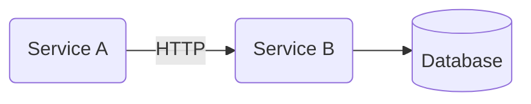
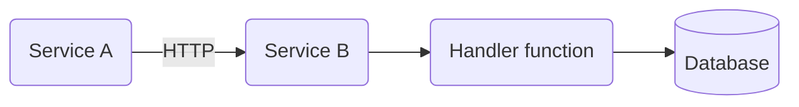
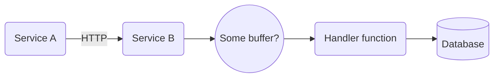

---
# try also 'default' to start simple
theme: default
title: Node and the art of Backpressure
info: |
  Backpressure and flow management are fundamental required for reliable integration of your Node servers with the rest of the system. Backpressure is relatively natural in synchronous runtimes but Node's async nature requires us to be mindful of it in our code.
  This talk explains backpressure, why it is important and how to properly implement it in Node.js.
class: text-center
# https://sli.dev/custom/highlighters.html
highlighter: shiki
# https://sli.dev/guide/drawing
drawings:
  persist: false
# slide transition: https://sli.dev/guide/animations#slide-transitions
transition: slide-left
# enable MDC Syntax: https://sli.dev/guide/syntax#mdc-syntax
mdc: true
---
# Node and the art of Backpressure
## Avishai Ish-Shalom

<div class="absolute flex flex-row bottom-4 left-2">

<span>@nukemberg</span>
</div>
---

# What's wrong with this code?

```javascript
const gzip = require('node:zlib').createGzip();
const fs = require('node:fs');

const inp = fs.createReadStream('input.file');
const out = fs.createWriteStream('output.gz');
gzip.on('data', (chunk) => {
    out.write(chunk);
})
inp.on('data', (chunk) => {
    gzip.write(chunk);
})
inp.on('end', () => out.close());
inp.on('close', () => out.close);
```

<v-click>

# 💩 

```shell
kernel: Memory cgroup out of memory: Killed process 133842 (node)
```
</v-click>

---

# But why???

- Fast reader
- Slow writer
- Writes buffered in memory


---

# Oh fuck


---

# It's everywhere!!




---

# Wait, wat?

<v-switch>
<template #1>

</template>

<template #2>

</template>

<template #3>

</template>

</v-switch>

---

# The event loop IS the buffer

